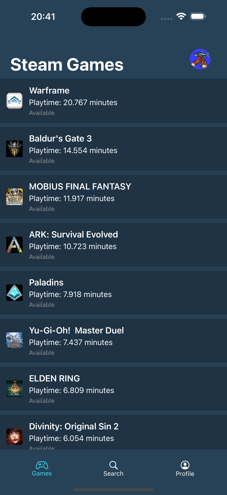
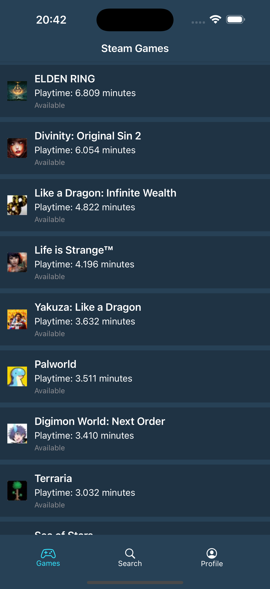

# Steam Profile

Here you can search for a **Steam** user and retrieve some data from the **steampowered** API.

## Usage

Enter the user Steam ID in the input box, then submit. You can find the ID on the user profile URL:  
**https://steamcommunity.com/profiles/STEAM_ID**  

# User game list

  
  

